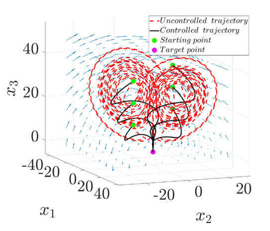

## Running the code
1. Please ensure that both the folders i.e., `SOS Toolbox` and `vanderpol gEDMD` are in the same location on your PC to solve the convex optimization using `sosopt` toolbox.
2. Run the file `vanderpol gEDMD/sampling/main_VDP_sampling.m` to generate the time-series data from the Van der Pol dynamics.
3. Run the file `vanderpol gEDMD/gEDMD/main_gedmdc.m` to obtain the Koopman generator matrix for the Van der Pol dynamics.
4. Run the file `vanderpol gEDMD/L1OCP/main_VDP_L1OCP.m` to solve the convex optimization to find the optimal control to stabilize the dynamics with respect to $`\mathcal{L}_1`$-norm in the cost function. Alternatively, run the file `vanderpol gEDMD/L2OCP/main_VDP_L2OCP.m` to solve the convex optimization with respect to $`\mathcal{L}_2`$-norm in the cost function.

## Results
The following figure showcases the optimal trajectories of the Van der Pol dynamics converging to $`\boldsymbol{X}_T=[0,0]`$. This is obtained by solving for the optimal control in the space of density. Here, $`\gamma`$ represents the discount factor in the cost function. It is observed that higher values of $`\gamma`$ lead to more aggressive control obtained from the optimization as seen in the second and third figures for $`\gamma=0`$ and $`\gamma=1`$ respectively. When $`\gamma=-5`$, the almost everywhere stability criteria do not satisfy the positivity condition which can be observed from the first figure where the trajectories do not converge to $`\boldsymbol{X}_T`$ and get stuck in the limit cycle of the dynamics. 

