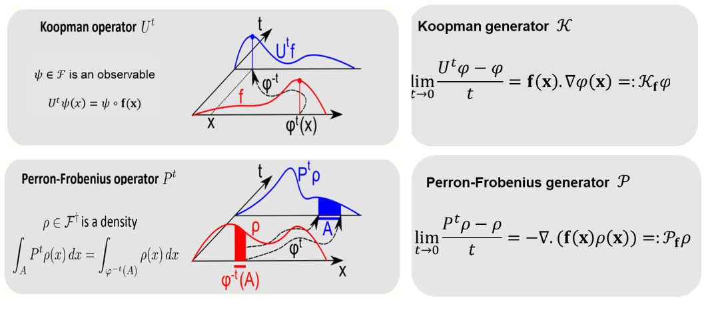
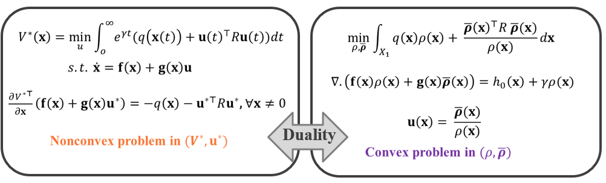

## Overview
The code in this repository is concerned with the data-driven optimal control of nonlinear systems. We present a
convex formulation of the optimal control problem with a discounted cost function. We consider
optimal control problems with both positive and negative discount factors. The convex approach
relies on lifting nonlinear system dynamics in the space of densities using the linear Perron–
Frobenius operator. This lifting leads to an infinite-dimensional convex optimization formulation of
the optimal control problem. The data-driven approximation of the optimization problem relies on
the approximation of the Koopman operator and its dual: the Perron–Frobenius operator, using a
polynomial basis function. We write the approximate finite-dimensional optimization problem as a
polynomial optimization which is then solved efficiently using a sum-of-squares-based optimization
framework. Refer to the [paper](https://www.sciencedirect.com/science/article/pii/S0005109822007087) for high-level details of the framework.

## SOS Toolbox
We use sum-of-squares-based (SOS) optimization in our convex framework to ensure the positivity of the density function $`\rho`$(**x**). We use `sosopt` which is a Matlab toolbox for formulating and solving Sum-of-Squares (SOS) polynomial optimizations. For more information on the `sosopt` toolbox, click [here](https://arxiv.org/abs/1308.1889). The `sosopt` toolbox requires the `multipoly` toolbox to construct the polynomial constraints. `multipoly` can be obtained from [here](http://www.aem.umn.edu/∼AerospaceControl/). `sosopt` also requires one of the following optimization codes for solving semidefinite programs (SDPs): `SeDuMi`, `SDPT3`, `CSDP`, `DSDP`, `SDPAM`, or `SDPLR`. The latest version of `SeDuMi` can be obtained from [here](http://sedumi.ie.lehigh.edu/). **For ease of access, we have provided all the required toolboxes in the folder titled** `SOS Toolbox`.

## Theory
### Koopman and Perron-Frobenius (P-F) operators
 Koopman operator is a linear operator in the function space. If **f**(**x**) is the vector field of the dynamics and the $`\psi`$(**x**) is an observable function or lifting function, the Koopman operator is defined w.r.t to the **f**(**x**) and is given as composition of the function $`\psi`$(**x**) with **f**(**x**). The linearity is a simple consequence of the composition $`\psi \;o`$ **f**(**x**) being a linear function  of the lifting function. Similarly, the P-F operator is a linear operator and gives you the evolution of the density of system trajectories in the function space. The Koopman and P-F operators are implemented for discrete-time systems. For continuous-time systems, we use Koopman and P-F generators. The Koopman generator is obtained by taking the inner product of **f**(**x**) and divergence of $`\psi`$(**x**), the lifting function, whereas the P-F generator is obtained by taking the product of **f**(**x**) and $`\rho`$(**x**), the lifting function, and then computing the negative of divergence of the product. 

### Convex formulation to optimal control problem
Any optimal control problem is typically written as minimizing a cost function while satisfying the system dynamics. Here, $`q`$(**x**) represents the state cost, **u**$`(t)`$ represents the required control, and $`R`$ represent the control weight matrix.  This optimization problem in the primal form is nonconvex with respect to optimal value function $`V^\star`$(**x**) and optimal control **u**$`^\star`$**(x)** and can’t be solved very easily. Therefore, we formulate this optimization problem in the dual space of density where the decision variables are $`\rho`$ and $`\bar{\boldsymbol{\rho}}`$. Here, the problem is now a convex problem with respect to $`\rho`$ and $`\bar{\boldsymbol{\rho}}`$ and the required control can be obtained by dividing $`\bar{\boldsymbol{\rho}}`$ with $`\rho`$. 

